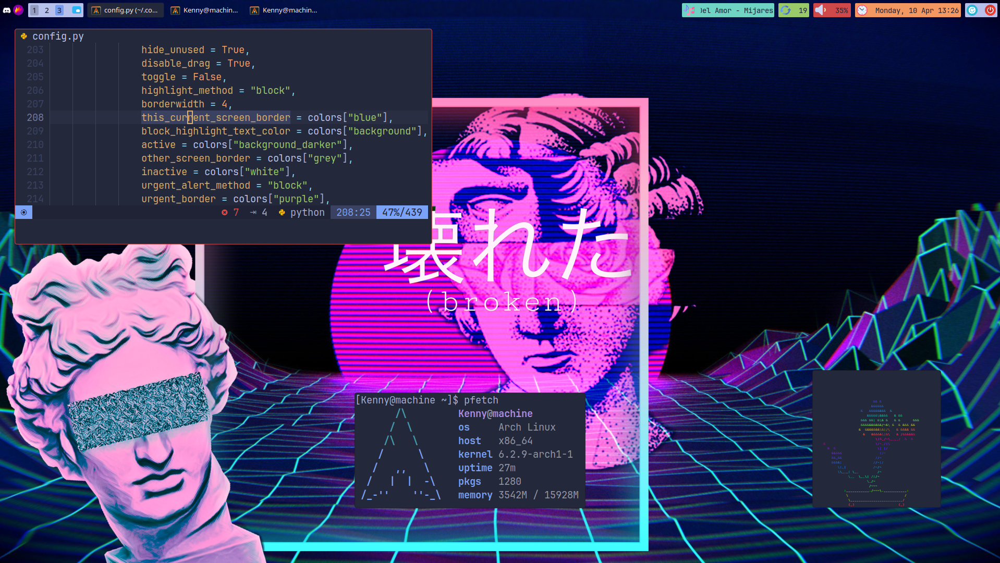
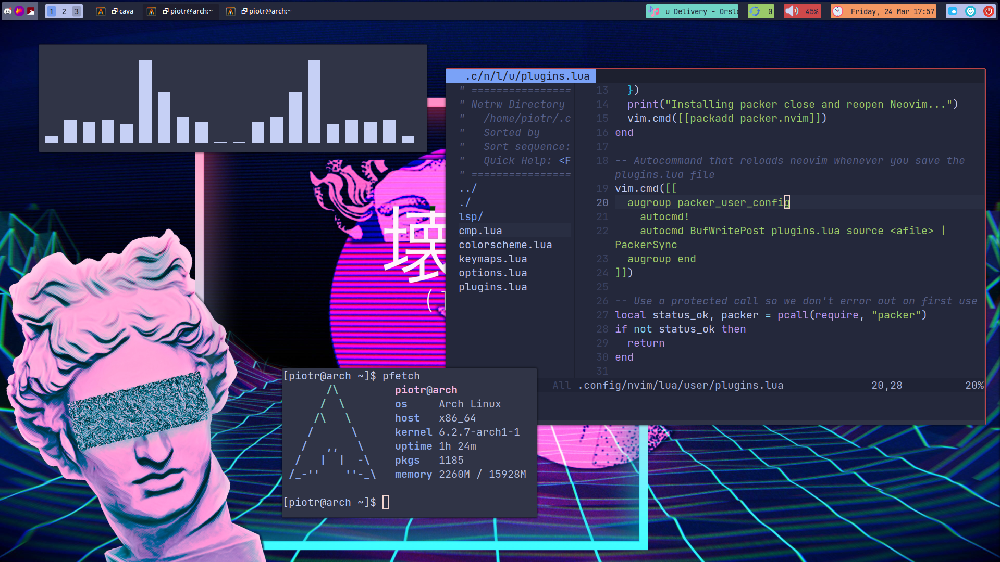

## My main [Qtile](http://www.qtile.org/) config

### Transparent bar, Tokyo Night colors:

### Tokyo Night:

### Catppuccin Mocha:

## Note:
INCLUDING [QTILE EXTRAS](https://qtile-extras.readthedocs.io/en/latest/). The height of the elements in the bar corresponds strictly with the font size and resolution (only left widgets)! Font - [JetBrains Mono](https://github.com/ryanoasis/nerd-fonts/blob/master/patched-fonts/JetBrainsMono/font-info.md). For specific configs see previous commits to copy-paste them.

## Troubleshooting:
If Mpris2 doesn't work [check this](https://github.com/elParaguayo/qtile-extras/issues/224).

If there isn't a volume icon, just reload the config. It have something to do with volume icon changing with volume levels.
