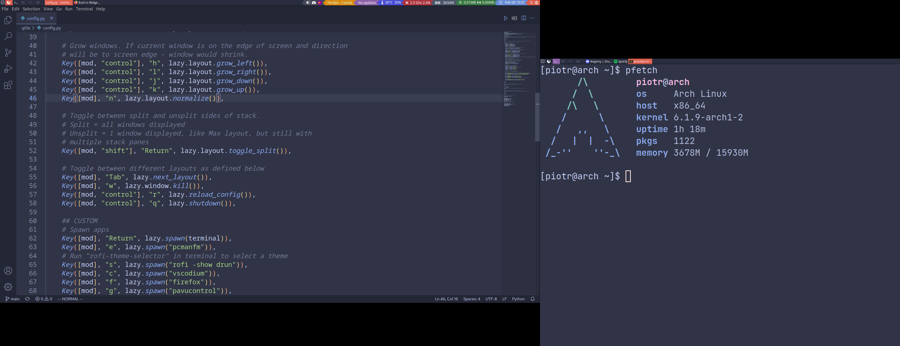
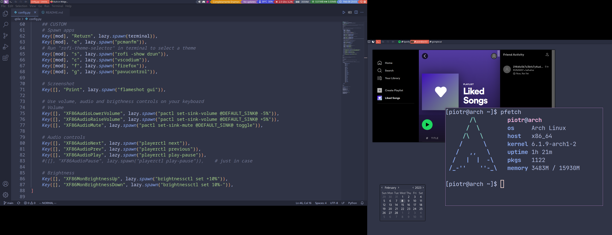
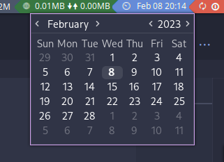

## Easy multihead Qtile config with many options 

Bar in main monitor:

Bar in second monitor:

Full view:



## Table of contents
* [Installation](#installation)
* [Configuration](#configuration)
* [Keybindings](#keybindings)
* [Mouse callbacks](#mouse-callbacks)
* [Issues](#issues)

## Installation
### Dependencies
- [Qtile (obviously)](http://www.qtile.org/)
- [Terminal emulator of choice](https://wikiless.tiekoetter.com/wiki/List_of_terminal_emulators?lang=en)
- [Gsimplecal (calendar)](https://github.com/dmedvinsky/gsimplecal)
- [Rofi (application launcher)](https://github.com/davatorium/rofi)
- [Htop (system monitor)](https://github.com/htop-dev/htop/)
- [Psutil (for some widgets)](https://pypi.org/project/psutil/)
- [Fonts for unicode support](https://libreddit.tiekoetter.com/r/linux/comments/22upqt/any_good_font_that_covers_unicode/)
- [Icons (in my config - Papirus)](https://github.com/PapirusDevelopmentTeam/papirus-icon-theme#installation)
### Optional
### Sound
- [Pulseaudio (for sound)](https://www.freedesktop.org/wiki/Software/PulseAudio/)
- [Pavucontrol (for sound control)](https://freedesktop.org/software/pulseaudio/pavucontrol/#download)
- [Playerctl (for keyboard audio control, requires Pavucontrol)](https://github.com/altdesktop/playerctl/releases)
- [Volume Control (for volume control, require Pavucontrol)](https://github.com/buzz/volctl)
### Other
- [Nitrogen (wallpaper setter)](https://github.com/l3ib/nitrogen)
- [Picom (for effects and transparency)](https://github.com/yshui/picom)
- [Brightnessctl (for brightness control)](https://github.com/Hummer12007/brightnessctl)
- [Flameshot (for screenshots)](https://flameshot.org/#download)
- [Pcmanfm (file manager)](https://github.com/lxde/pcmanfm)
- [Spotify (for music)](https://www.spotify.com/us/download/linux/)
- [Discord Canary (canary doesn't crash)](https://discord.com/download)
- [Firefox (browser)](https://www.mozilla.org/en-US/firefox/linux/)
- [Vscodium (VSCode without MS telemetry)](https://github.com/VSCodium/vscodium/releases)

## Configuration

<br>If you want [gsimplecal](https://github.com/dmedvinsky/gsimplecal) to open below clicked date, configure position of window in gsimplecal configuration:
```
mainwindow_position = none
mainwindow_xoffset = 1642
mainwindow_yoffset = 0
```

## Keybindings
### TL;DR Default + custom
Every action from default qtile config is integrated in here for general use, but I added some more:
- "mod" + "a"/"d" - When in Max layout you can move focus to different windows.
- "mod" + "e" - To open Pcmanfm (or any file manager of your choice).
- "mod" + "s" - To open Rofi to easy search for applications.
- "mod" + "c" - To open Vscodium.
- "mod" + "f" - To open Firefox.
- "mod" + "g" - To open Pavucontrol.

## Mouse callbacks
### TL;DR Many mouse callbacks in the bar
Most of widgets on the bar have actions assigned to mouse (using left mouse click):
- Layout Icon - Change layout.
- GroupBox - Change workspace.
- Tasklist - Change fucused window.
- System tray - Interact with programs on system tray.
- Mpris2 (spotify player) - Play/pause music.
- Update list - Open terminal in a new window, and update system.
- NvidiaSensors - Informations about Nvidia GPU.
- CPU - Open sensors (temperature for CPU and other parts)
- Memory - LEFT: Open htop, RIGHT: Open free.
- Net - Show network configuration.
- Date and hour - Open calendar beneath.
- 🗘 - Restart system.
- ⏼ - Shutdown system.

## Issues
There are some issues:
- Problem: If you open an application in Max layout, it won't add to tasklist and just obey A-D "arrows", it will go after window, in which you opened it. Solution: Restart qtile (Mod + Ctrl + R) 
- Problem: After restarting Qtile, Mpris2 won't display currently playing track. Solution: Go to the next song, and return.
- Problem: Updates fairly rarely show how many updates there are, but update interval is set to 0,5 hour. Solution: It defeats all purpouse, but you need to update it manually.

## TODO
Some minor changes, maybe add Qtile-extras support.